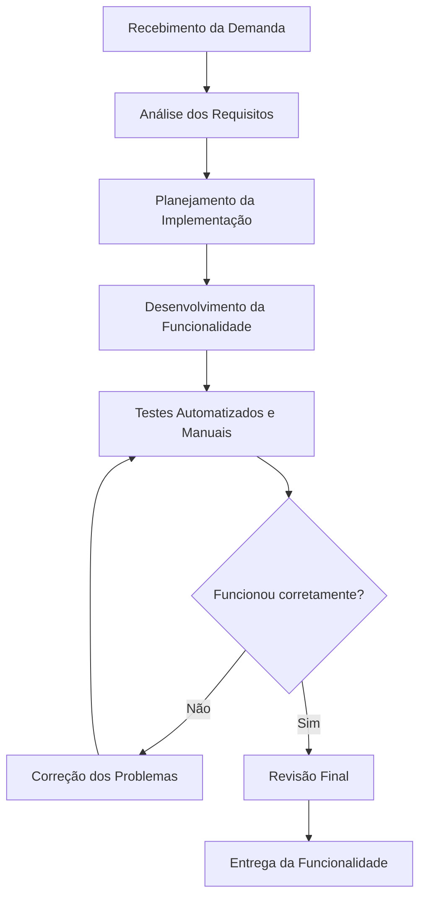

# Aula 14 – Qualidade de Processo – LocalEats

**Centro Universitário Senac-RS**  
**Curso:** ADS / SPI – Análise e Desenvolvimento de Sistemas / Sistemas para Internet  
**Unidade Curricular:** Qualidade de Software  
**Professor:** Luciano Zanuz

## Integrantes

- Nicolas Diovani
- Pedro Bavaresco

---

# 1. Mapeamento do Processo Atual

O processo de desenvolvimento utilizado pela equipe para implementar novas funcionalidades no sistema **LocalEats** segue um fluxo simples, contemplando desde o recebimento da demanda até a entrega da funcionalidade validada.

## Fluxograma (Mermaid)

### Descrição do Processo

1. A equipe recebe uma nova demanda ou requisito.
2. Os integrantes analisam o que precisa ser desenvolvido.
3. É realizado um planejamento simples da implementação.
4. A funcionalidade é desenvolvida.
5. São executados testes automatizados, quando disponíveis, e testes manuais.
6. Caso sejam encontrados erros, eles são corrigidos e os testes são repetidos.
7. Após a validação, é realizada uma revisão final.
8. A funcionalidade é entregue.

---

# 2. Entradas, Atividades e Saídas

| Etapa | Entrada | Atividade | Saída |
|--------|----------|-----------|--------|
| Recebimento da demanda | Requisito ou solicitação | Registrar e compreender a necessidade | Demanda definida |
| Análise dos requisitos | Demanda definida | Entender regras de negócio e funcionalidades | Requisitos compreendidos |
| Planejamento | Requisitos analisados | Definir estratégia de implementação | Plano de desenvolvimento |
| Desenvolvimento | Plano de desenvolvimento | Implementar a funcionalidade | Código desenvolvido |
| Testes | Código desenvolvido | Executar testes manuais e automatizados | Erros identificados ou funcionalidade validada |
| Correção | Relatório de erros | Corrigir defeitos encontrados | Código corrigido |
| Revisão Final | Código validado | Conferência geral da implementação | Funcionalidade aprovada |
| Entrega | Funcionalidade aprovada | Publicação ou disponibilização da atualização | Funcionalidade entregue ao usuário |

---

# 3. Reflexão sobre o Processo

## O processo utilizado pela equipe está claramente definido?

Sim. Embora seja um processo relativamente simples, todas as etapas principais são conhecidas pelos integrantes, desde o recebimento da demanda até a entrega da funcionalidade. Isso reduz dúvidas durante o desenvolvimento e facilita a organização do trabalho.

---

## Todos os integrantes seguem o mesmo fluxo de trabalho?

Sim. Os dois integrantes utilizam o mesmo fluxo de desenvolvimento, realizando inicialmente a análise da tarefa, depois a implementação, os testes e, caso necessário, as correções antes da entrega.

---

## Em quais etapas a qualidade é verificada?

A qualidade é verificada em diferentes momentos do processo:

- Durante o desenvolvimento, seguindo boas práticas de programação;
- Na execução dos testes automatizados;
- Nos testes manuais da aplicação;
- Durante a revisão final antes da entrega.

Essas verificações reduzem a possibilidade de defeitos chegarem ao usuário final.

---

## Quais melhorias poderiam tornar o processo mais eficiente?

Algumas melhorias que poderiam ser adotadas são:

- Utilização de revisões de código (Code Review);
- Definição de critérios de aceitação para todas as tarefas;
- Automatização de mais testes;
- Integração Contínua (CI) para execução automática dos testes;
- Maior documentação das funcionalidades implementadas;
- Utilização de um quadro Kanban para acompanhamento das tarefas.

Essas práticas aumentam a organização da equipe e reduzem retrabalho.

---

## Como a qualidade do processo impacta a qualidade do produto final?

A qualidade do processo influencia diretamente a qualidade do software. Quando existe um fluxo organizado, com planejamento, desenvolvimento, testes e validação, os erros são identificados mais cedo, diminuindo retrabalho e aumentando a confiabilidade do sistema.

Além disso, um processo bem definido melhora a comunicação entre os integrantes da equipe, facilita a manutenção do código e torna o desenvolvimento mais previsível. Dessa forma, o usuário recebe um produto mais estável, seguro e com menor quantidade de defeitos.

---

# Conclusão

O desenvolvimento de software não depende apenas da qualidade do código, mas também da qualidade do processo utilizado pela equipe. Um processo organizado permite identificar problemas antecipadamente, melhorar a colaboração entre os integrantes e garantir entregas mais confiáveis.

Durante esta atividade foi possível compreender que práticas como planejamento, testes, correções e validação contínua contribuem diretamente para a produção de um software de maior qualidade. Dessa forma, investir na melhoria do processo é uma estratégia essencial para o sucesso do projeto LocalEats.